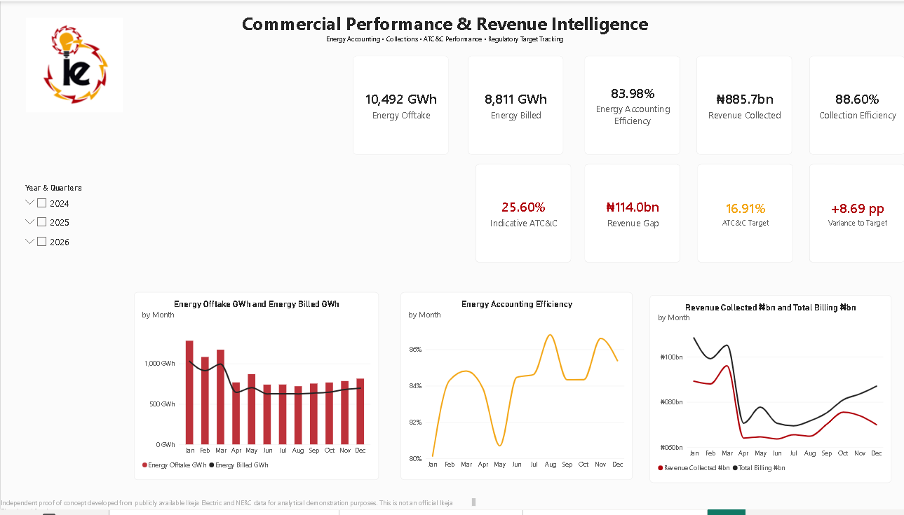
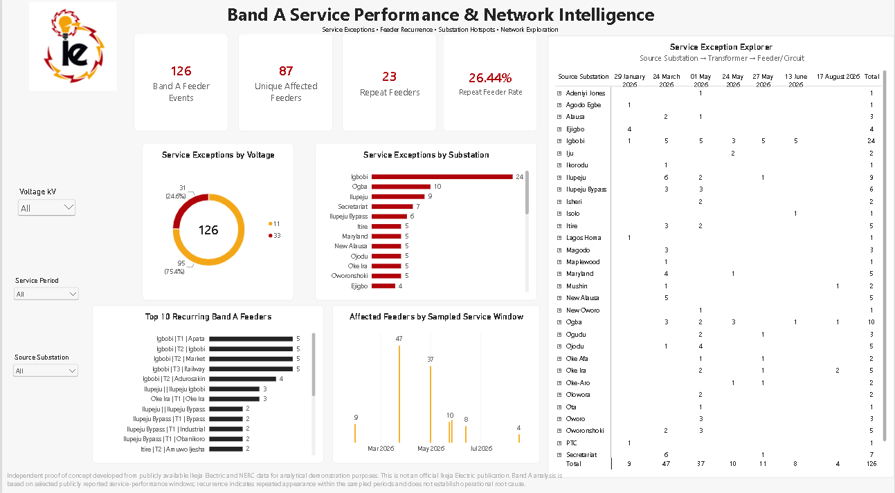
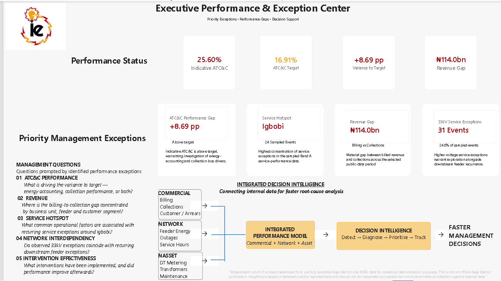

# Ikeja Electric Decision Intelligence | Power BI

## Commercial Performance, ATC&C & Band A Service Intelligence

A Power BI decision-intelligence proof of concept that transforms publicly available Nigerian electricity-distribution data into management-level commercial and service-performance insights, using **Ikeja Electric** as the case study.

The project combines **27 months of commercial performance data (January 2024 – March 2026)** with **Band A service-event intelligence from January – August 2026** to demonstrate how regulatory and operational data can support performance monitoring, exception identification and management decision-making.

---

## Project Overview

Electricity distribution performance requires management to understand both the commercial conversion of energy into revenue and the service exceptions occurring across the network.

This project was developed to bring these perspectives together.

The analysis addresses two principal management questions:

1. **Commercial Performance:** How effectively is energy received being converted into billed energy and ultimately collected revenue, and how does indicative ATC&C compare with target?

2. **Band A Service Performance:** Where are recorded Band A service events occurring, and which feeders, substations or voltage levels show recurring exception patterns?

The resulting Power BI solution provides three management views:

1. **Executive Commercial Performance**
2. **Band A Service Intelligence**
3. **Executive Exception Centre**

---

## Analysis Period & Scope

The project combines two analytical datasets covering different reporting periods.

### Commercial Performance

**January 2024 – March 2026 (27 months)**

The commercial dataset supports analysis of:

- Energy Offtake
- Energy Billed
- Energy Accounting Efficiency
- Total Billing
- Revenue Collected
- Collection Efficiency
- Indicative ATC&C
- ATC&C Target
- ATC&C Variance to Target
- Revenue Gap

### Band A Service Intelligence

**January – August 2026**

The Band A analysis is based on a researched sample of **126 feeder-service events captured across seven reporting windows**.

The dataset supports analysis of:

- feeder-event volume;
- unique affected feeders;
- repeat feeders;
- repeat feeder rate;
- source-substation concentration;
- 11kV and 33kV service events;
- service-period patterns; and
- recurring service exceptions.

> **Scope note:** The Band A dataset is an event-based analytical sample and should not be interpreted as a complete census of every network interruption or service condition across the entire Ikeja Electric network.

---

# Dashboard

## 1. Executive Commercial Performance



The Executive Commercial Performance page provides a management-level view of the relationship between energy received, energy billed and revenue collected.

It brings together energy, billing, collection and ATC&C indicators to show how effectively energy input is being converted into commercial value.

### Key Measures

- Energy Offtake GWh
- Energy Billed GWh
- Energy Accounting Efficiency
- Total Billing ₦bn
- Revenue Collected ₦bn
- Collection Efficiency
- Indicative ATC&C
- ATC&C Target
- ATC&C Variance to Target
- Revenue Gap ₦bn

The page also provides monthly trend analysis of:

- Revenue Collected vs Total Billing
- Energy Accounting Efficiency
- Energy Offtake vs Energy Billed

Year and Quarter selections allow management to investigate performance across different reporting periods.

---

## 2. Band A Service Intelligence



The Band A Service Intelligence page shifts the analysis from commercial performance to service exceptions.

Rather than relying only on total event volume, the page identifies recurring feeders and concentrations of events across source substations and voltage levels.

### Key Measures

- Band A Feeder Events
- Unique Affected Feeders
- Repeat Feeders
- Repeat Feeder Rate
- 11kV Events
- 33kV Events

### Analytical Views

The dashboard examines service events by:

- Feeder
- Source Substation
- Voltage Level
- Service Date
- Service Period

This allows the analysis to move from the overall event population to specific areas of recurring service activity.

> Repeat events identify recurrence within the available data; they do not independently establish the engineering root cause of the service issue.

---

## 3. Executive Exception Centre



The Executive Exception Centre brings the principal commercial and service-performance exceptions into a focused management view.

Rather than requiring management to examine every underlying record, the page highlights indicators requiring further attention.

### Principal Indicators

- ATC&C Target
- Indicative ATC&C
- ATC&C Variance to Target
- Revenue Gap ₦bn
- Top Exception Substation
- Top Substation Events
- 33kV Service Events

The page connects commercial-performance gaps with network/service exceptions to support prioritisation and further investigation.

---

# KPI Framework

## Commercial Performance

The commercial performance logic follows the energy-to-cash conversion chain:

```text
Energy Offtake
      ↓
Energy Billed
      ↓
Energy Accounting Efficiency
             +
Total Billing
      ↓
Revenue Collected
      ↓
Collection Efficiency
             ↓
      Indicative ATC&C
```

Indicative ATC&C is subsequently compared with the applicable target:

```text
Indicative ATC&C
        -
ATC&C Target
        =
ATC&C Variance to Target
```

Revenue conversion is additionally evaluated through:

```text
Total Billing
      -
Revenue Collected
      =
Revenue Gap
```

---

## Band A Service Intelligence

The service-intelligence framework progresses from overall event volume to recurrence and concentration:

```text
Band A Feeder Events
        ↓
Unique Affected Feeders
        ↓
Repeat Feeders
        ↓
Repeat Feeder Rate
```

The same event population is then segmented by:

```text
Voltage Level
     ↓
11kV / 33kV Events

Source Substation
     ↓
Top Exception Substation
     ↓
Top Substation Events
```

This structure helps distinguish event volume from recurring and concentrated service exceptions.

---

# Core KPI Definitions

| KPI | Calculation | Interpretation |
|---|---|---|
| Energy Offtake GWh | Sum of Energy Offtake | Energy received/offtaken |
| Energy Billed GWh | Sum of Energy Billed | Energy represented in customer billing |
| Energy Accounting Efficiency | Energy Billed ÷ Energy Offtake | Conversion of energy received into billed energy |
| Total Billing ₦bn | Sum of Total Billing | Monetary value billed |
| Revenue Collected ₦bn | Sum of Revenue Collected | Revenue collected from customers |
| Collection Efficiency | Revenue Collected ÷ Total Billing | Conversion of billing into collected revenue |
| Indicative ATC&C | 1 − (Accounting Efficiency × Collection Efficiency) | Indicative combined loss pressure |
| ATC&C Variance to Target | (Indicative ATC&C − Target) × 100 | Difference from target in percentage points |
| Revenue Gap ₦bn | Total Billing − Revenue Collected | Billing-to-collection gap |
| Band A Feeder Events | Count of service-event records | Total event population |
| Unique Affected Feeders | Distinct count of standardised feeders | Number of affected feeders |
| Repeat Feeders | Feeders with more than one event | Recurring feeder exceptions |
| Repeat Feeder Rate | Repeat Feeders ÷ Unique Affected Feeders | Proportion of affected feeders with recurring events |
| 11kV Events | Band A Events filtered to 11kV | 11kV event volume |
| 33kV Events | Band A Events filtered to 33kV | 33kV event volume |

---

# Selected DAX

## Indicative ATC&C

```DAX
Indicative ATC&C = 
1 -
(
    [Energy Accounting Efficiency] *
    [Collection Efficiency]
)
```

## ATC&C Variance to Target

```DAX
ATC&C Variance to Target = 
([Indicative ATC&C] - [ATC&C Target]) * 100
```

## Revenue Gap

```DAX
Revenue Gap ₦bn = 
[Total Billing ₦bn] -
[Revenue Collected ₦bn]
```

## Repeat Feeders

```DAX
Repeat Feeders = 
COUNTROWS(
    FILTER(
        VALUES(FactBandAService[Standardised Feeder Name]),
        CALCULATE(COUNTROWS(FactBandAService)) > 1
    )
)
```

## Repeat Feeder Rate

```DAX
Repeat Feeder Rate = 
DIVIDE(
    [Repeat Feeders],
    [Unique Affected Feeders]
)
```

## Top Exception Substation

```DAX
Top Exception Substation = 
VAR SubstationTable =
    TOPN(
        1,
        ADDCOLUMNS(
            VALUES(FactBandAService[Source Substation]),
            "Events", [Band A Feeder Events]
        ),
        [Events], DESC
    )
RETURN
    CONCATENATEX(
        SubstationTable,
        FactBandAService[Source Substation],
        ", "
    )
```

Full KPI definitions and DAX documentation are available in:

**[KPI Definitions](documentation/KPI-Definitions.md)**

---

# Analytical Approach

The project follows a decision-intelligence workflow rather than treating dashboard development as the final analytical objective.

### 1. Data Research

Publicly available regulatory and operational information was researched and structured into analysis-ready datasets.

### 2. Data Preparation

Data was cleaned and standardised to support consistent time-series, feeder, substation and voltage-level analysis.

### 3. Data Modelling

The Power BI semantic model separates commercial performance, ATC&C benchmarking and Band A service-event information while allowing each analytical area to respond to its appropriate reporting context.

### 4. KPI Development

DAX measures were developed for:

- energy accounting;
- billing and collection performance;
- indicative ATC&C;
- target variance;
- revenue gaps;
- feeder recurrence;
- voltage-level service events; and
- substation exception concentration.

### 5. Management Visualisation

The final report was organised into three decision layers:

```text
Commercial Performance
        ↓
Service Intelligence
        ↓
Executive Exception Management
```

The objective is to move from **data → performance indicators → exceptions → management attention**.

---

# Analytical Boundaries

## Indicative ATC&C

The project deliberately uses the term **Indicative ATC&C**.

The measure is calculated from the available Energy Accounting Efficiency and Collection Efficiency data and is intended for analytical decision support.

It should not be represented as an independently audited or official regulatory ATC&C result.

## Band A Service Events

The Band A analysis represents the service-event records contained within the research dataset.

The results should not automatically be interpreted as a complete representation of all network interruptions or conditions across the Ikeja Electric distribution network.

## Repeat Feeders

A repeat feeder identifies recurrence within the available dataset.

Recurrence alone does not establish technical root cause.

## Top Exception Substation

The Top Exception Substation identifies the source substation with the highest event concentration within the applicable data and filter context.

It is a prioritisation indicator rather than an engineering diagnosis.

## Revenue Gap

Revenue Gap represents the difference between billed value and collected revenue within the analytical period.

It should not automatically be interpreted as permanently unrecoverable revenue.

---

# Tools & Skills Demonstrated

### Power BI

- Data modelling
- Interactive dashboard development
- KPI design
- Filter-context management
- Executive reporting

### DAX

- `CALCULATE`
- `DIVIDE`
- `COUNTROWS`
- `DISTINCTCOUNT`
- `FILTER`
- `VALUES`
- `TOPN`
- `ADDCOLUMNS`
- `MAXX`
- `CONCATENATEX`
- `FORMAT`

### Analytics

- Commercial performance analysis
- Energy accounting
- Revenue analysis
- ATC&C performance analysis
- Target variance analysis
- Exception analysis
- Recurrence analysis
- Service-performance intelligence
- Management decision support

### Domain

- Nigerian electricity distribution
- Distribution-company commercial performance
- Energy-to-revenue conversion
- Band A service monitoring
- Electricity-sector performance intelligence

---

# Documentation

Detailed technical documentation is available in the repository:

- **[Data Dictionary](documentation/Data-Dictionary.md)** – business definitions, fields, units, formulas and analytical scope.
- **[KPI Definitions](documentation/KPI-Definitions.md)** – KPI logic, exact DAX measures, interpretation and validation rules.

---

# Power BI File

The complete Power BI report is included in this repository:

**`Ikeja-Electric-Decision-Intelligence.pbix`**

The PBIX contains the data model, DAX measures and final three-page analytical report.

---

# Live Interactive Dashboard

A public interactive version of the Power BI report will be linked here after publication through Power BI Service.

**Live Dashboard:** Coming soon

---

# Project Purpose

This project was developed as a portfolio proof of concept to demonstrate how **business analysis, data analytics and electricity-sector domain knowledge** can be combined to convert publicly available operational information into management decision intelligence.

The project is not presented as an official Ikeja Electric analytical product.

---

## Author

**Ndubuisi Anozie**  
Business & Data Analyst | Energy & Power Sector Analytics

**LinkedIn:** www.linkedin.com/in/ndubuisi-anozie  
**GitHub:** nanozie-coder
